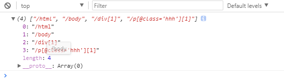
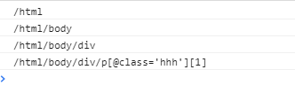

###     xpath使用文档

####    xpath.js文件

>  综述： 这个文件是调用 getSimilarElements方法， 接受一个选择器（selecter），可以使dom元素也可以是字符串选择器，返回所有拥有相同或者相似路径的dom元素。

#####   函数解析

-   XPath
    核心函数,在插件内部会自动创建一个XPath对象，这个对象可以访问XPath的原型上所有的函数。
    内部有三个成员变量：
    1、this.xpath,是一个数组用来存储dom的各个路径，xpath的对象结构如下所示：

    

    2、this.thisPath 存储的是传入dom的拼接起来的路径，例如：

    "/html/body/div[1]/p[@class='hhh'][1]"

    3、this.similarPath 存储的是与传入dom路径相似的dom 的路径,例如：
    
    “/html/body/div/p[@class='hhh'][1]”
    

-   getSimilarElements(selector)
    
    此方法接收一个路径选择器（字符串）或一个dom元素，返回一个与传入路径相似的dom的数组

-   getPath(selector)

    接收一个dom元素，并将该dom元素的路径提取并存放在 thisPath变量中，最后返回this（即调用该方法的对象）

-   getElements(xpath)

    接收一个 路径，返回与该路径匹配的所有dom元素的数组

-   generateXpath(selector)

    接收一个字符串选择器或者一个dom元素，返回该dom或者选择器的xpath路径
    

####    operation.js文件

>  综述： 这个文件是设置鼠标滑过、选中或者点击dom元素时的各种样式。内部是通过给标签增加特定的属性从而实现某种样式。（通过属性增加的样式要提前写好）

#####   常用的样式属性

-   highlight-add   鼠标左键点击某元素时增加的属性（样式）

-   highlight-add-single    鼠标右键点击某元素时增加的属性（样式）

-   highlight   鼠标滑过某元素时增加的属性（样式）

